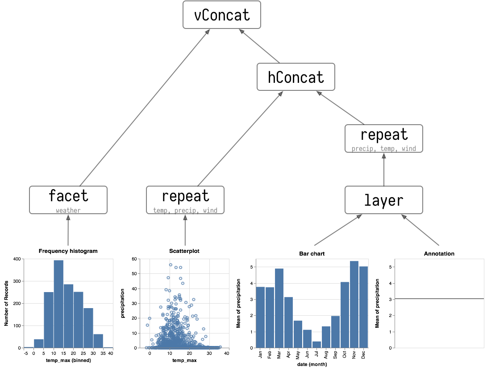

<link href="https://fonts.googleapis.com/css?family=Roboto+Condensed:300|Fjalla+One" rel="stylesheet">
@import "css/tutorial.less"

1.  [Introduction](elmVegaWalkthrough1.md)
2.  [Single View Specifications](elmVegaWalkthrough2.md)
3.  **Layered and Multi-view Composition**
4.  [Interaction](elmVegaWalkthrough4.md)

---

## Layered and Multi-view Composition ([8:28](https://youtu.be/9uaHRWj04D4?t=8m28s))

To show our weather distributions next to each other rather than stacked on top of each other, we simply encode column position in a row of small multiples with the `weather` data field:

```elm {v l s}
smallMultiples : Spec
smallMultiples =
    let
        enc =
            encoding
                << position X
                    [ PName "temp_max"
                    , PmType Quantitative
                    , PBin []
                    , PAxis [ AxTitle "" ]
                    ]
                << position Y
                    [ PAggregate Count
                    , PmType Quantitative
                    ]
                << color
                    [ MName "weather"
                    , MmType Nominal
                    , MLegend []
                    , MScale weatherColors
                    ]
                << column
                    [ FName "weather"
                    , FmType Nominal
                    ]
    in
    toVegaLite [ width 110, height 110, seattleData, mark Bar [], enc [] ]
```

There are only two additions in order to create these small multiples.
Firstly we have an extra encoding with the `column` function specifying the `weather` data field as the one to determine which column each data item gets mapped to.
Note that the `F` prefix for `FName` and `FmType` refers to _facet_ – a form of data selection and grouping standard in data visualization.

The second, minor change, is to include an `MLegend` specification in the color encoding. The legend can be customised with its parametmer list but here by providing an empty list, we declare we do not wish the default legend to appear (the arrangement into columns with color encoding and default column labels make the legend redundant).

### Multi-view Composition Operators ([9:00](https://youtu.be/9uaHRWj04D4?t=9m00s))

There are four ways in which multiple views may be combined:

*   The **facet operator** takes subsets of a dataset (facets) and separately applies the same view specification to each of those facets (as seen with the `column` function above).
    elm-vega functions to create faceted views: `column`, `row`, `facet` and `specification`.

*   The **layer operator** creates different views of the data but each is layered (superposed) on the same same space, for example a trend line layered on top of a scatterplot.
    elm-vega functions to create a layered view: `layer` and `asSpec`.

*   The **concatenation operator** allows arbitrary views (potentially with different datasets) to be assembled in rows or columns.
    This allows 'dashboards' to be built.
    elm-vega functions to create concatenated views: `vConcat`, `hConcat` and `asSpec`.

*   The **repeat operator** is a concise way of combining multiple views with only small data-driven differences in each view.
    elm-vega functions for repeated views: `repeat` and `specification`.

## Composition Example: Precipitation in Seattle ([9:40](https://youtu.be/9uaHRWj04D4?t=9m40s))

As a basis for discussing view composition, let's start with a single bar chart showing monthly precipitation in Seattle:

```elm {v l s}
barChart : Spec
barChart =
    let
        enc =
            encoding
                << position X
                    [ PName "date"
                    , PmType Ordinal
                    , PTimeUnit Month
                    ]
                << position Y
                    [ PName "precipitation"
                    , PmType Quantitative
                    , PAggregate Mean
                    ]
    in
    toVegaLite [ seattleData, mark Bar [], enc [] ]
```

(Note that here we've cast the date, which has been quantized into monthly intervals, to be ordinal so that bars span the full width of each month.)

We can generalise this a little within Elm by allowing the data field to be counted (here `precipitation`) to be specified as a parameter along with a customisable width `w` to a function that returns the temporal bar chart specification:

```elm {l}
temporalBarSpec : PositionChannel -> Float -> Spec
temporalBarSpec pField w =
    let
        enc =
            encoding
                << position X [ PName "date", PmType Ordinal, PTimeUnit Month ]
                << position Y [ pField, PmType Quantitative, PAggregate Mean ]
    in
    asSpec [ width w, height w, mark Bar [], enc [] ]
```

This can then be passed to `toVegaLite` as its own _layer_:

```elm {l s}
barChart : Spec
barChart =
    toVegaLite [ seattleData, layer [ temporalBarSpec (PName "precipitation") 180 ] ]
```

### Composing layers ([10:08](https://youtu.be/9uaHRWj04D4?t=10m08s))

We can annotate the chart by placing the bar chart specification in a layer and adding another layer with the annotation.
In this example we will add a layer showing the average precipitation for the entire period:

```elm {v l s}
barChart : Spec
barChart =
    let
        dataField =
            PName "precipitation"

        enc =
            encoding << position Y [ dataField, PmType Quantitative, PAggregate Mean ]
    in
    toVegaLite
        [ seattleData
        , layer [ temporalBarSpec dataField 180, asSpec [ enc [], mark Rule [] ] ]
        ]
```

The temporal bar encoding is as it was previously.
We add a similar average line specification but only need to encode the y-position as we wish to span the entire chart space with the `rule` mark.
The two specifications are combined as layers with the `layer` function which we add to the list of specifications passed to `toVegaLite` in place of the original bar specification.

Again it becomes a simple job to refactor this bar chart and average marker so that it will work with any named data field and width:

```elm {l}
temporalAvBarSpec : PositionChannel -> Float -> Spec
temporalAvBarSpec dataField w =
    let
        enc =
            encoding << position Y [ dataField, PmType Quantitative, PAggregate Mean ]
    in
    asSpec
        [ layer [ temporalBarSpec dataField w, asSpec [ enc [], mark Rule [] ] ] ]
```

### Concatenating views ([10:47](https://youtu.be/9uaHRWj04D4?t=10m47s))

Instead of layering one view on top of another (superposition), we can place them side by side in a row or column (juxtaposition). In Vega-Lite this is referred to as _concatenation_:

```elm { v l s}
barCharts : Spec
barCharts =
    toVegaLite
        [ seattleData
        , vConcat
            [ temporalBarSpec (PName "precipitation") 180
            , temporalBarSpec (PName "temp_max") 180
            ]
        ]
```

Concatenated views are specified in the same way as layered views expect that we use the `vConcat` function (or `hConcat` for a horizontal arrangement) in place of `layer`.

### Repeated Views ([11:08](https://youtu.be/9uaHRWj04D4?t=11m08s))

Noting that juxtaposing similar charts is a common operation, and the specification for each of them often is very similar, the repeat operator allows us to streamline the specification required to do this.
We might, for example, wish to show three data fields from the Seattle weather dataset:

```elm {v l s}
barCharts : Spec
barCharts =
    toVegaLite
        [ seattleData
        , repeat [ RowFields [ "precipitation", "temp_max", "wind" ] ]
        , specification (temporalBarSpec (PRepeat Row) 150)
        ]
```

This more compact specification replaces the data field name (`PName "precipitation"` etc.) with a reference to the repeating field (`PRepeat`) either as a `Row` or `Column` depending on the desired layout. We then compose the specifications by providing a set of `RowFields` (or `ColumnFields`) containing a list of the fields to which we wish to apply the specification (identified with the function `specification` which should follow the `repeat` function provided to `toVegaLite`).

We can combine repeated rows and repeated columns to create a grid of views, such as a scatterplot matrix (or SPLOM for short):

```elm {v l s}
splom : Spec
splom =
    let
        enc =
            encoding
                << position X [ PRepeat Column, PmType Quantitative ]
                << position Y [ PRepeat Row, PmType Quantitative ]

        spec =
            asSpec
                [ width 120
                , height 120
                , mark Point [ MStrokeWidth 0.4 ]
                , enc []
                ]
    in
    toVegaLite
        [ seattleData
        , repeat
            [ RowFields [ "temp_max", "precipitation", "wind" ]
            , ColumnFields [ "wind", "precipitation", "temp_max" ]
            ]
        , specification spec
        ]
```

### Building A Dashboard ([12:40](https://youtu.be/9uaHRWj04D4?t=12m40s))

We can compose more complex 'dashboards' by assembling single views but varying either their encoding or the data that is encoded. To illustrate, let's first identify the four single view types that we will compose with (all of these we have considered above, but are shown here again for clarity).

```elm {v}
histogram : Spec
histogram =
    let
        w =
            105

        histoEnc =
            encoding
                << position X [ PName "temp_max", PmType Quantitative, PBin [] ]
                << position Y [ PAggregate Count, PmType Quantitative ]

        histoSpec =
            asSpec [ width w, height w, mark Bar [], histoEnc [] ]

        scatterEnc =
            encoding
                << position X [ PName "temp_max", PmType Quantitative ]
                << position Y [ PName "precipitation", PmType Quantitative ]

        scatterSpec =
            asSpec [ width w, height w, mark Point [ MStrokeWidth 0.3 ], scatterEnc [] ]

        barEnc =
            encoding
                << position X [ PName "date", PmType Ordinal, PTimeUnit Month ]
                << position Y [ PName "precipitation", PmType Quantitative, PAggregate Mean ]

        barSpec =
            asSpec [ width w, height w, mark Bar [], barEnc [] ]

        lineEnc =
            encoding
                << position Y [ PName "precipitation", PmType Quantitative, PAggregate Mean ]

        lineSpec =
            asSpec [ width w, height w, mark Rule [], lineEnc [] ]
    in
    toVegaLite
        [ seattleData
        , hConcat [ histoSpec, scatterSpec, barSpec, lineSpec ]
        ]
```

As we have seen, we can arrange combinations of these views with the composition operators _layer_, _facet_, _repeat_ and _concatenate_. The specifications that result can themselves be further composed with the same operators to form a tree of compositions:



This allows us to create a nested dashboard of views:

```elm {l}
dashboard : Data -> Spec
dashboard data =
    let
        scatterEnc =
            encoding
                << position X [ PRepeat Column, PmType Quantitative ]
                << position Y [ PRepeat Row, PmType Quantitative ]

        scatterSpec =
            asSpec [ mark Point [ MStrokeWidth 0.4 ], scatterEnc [] ]

        splomSpec =
            asSpec
                [ repeat
                    [ RowFields [ "temp_max", "precipitation", "wind" ]
                    , ColumnFields [ "wind", "precipitation", "temp_max" ]
                    ]
                , specification scatterSpec
                ]

        barsSpec =
            asSpec
                [ repeat [ RowFields [ "precipitation", "temp_max", "wind" ] ]
                , specification (temporalAvBarSpec (PRepeat Row) 150)
                ]

        histoEnc =
            encoding
                << position X [ PName "temp_max", PmType Quantitative, PBin [], PAxis [ AxTitle "Max temp" ] ]
                << position Y [ PAggregate Count, PmType Quantitative ]
                << color [ MName "weather", MmType Nominal, MLegend [], MScale weatherColors ]
                << column [ FName "weather", FmType Nominal ]

        histoSpec =
            asSpec [ width 120, height 120, mark Bar [], histoEnc [] ]
    in
    toVegaLite
        [ data
        , vConcat [ asSpec [ hConcat [ splomSpec, barsSpec ] ], histoSpec ]
        ]
```

> _**Note**: There is a [bug](https://github.com/vega/vega-lite/issues/3595) in Vega-Lite that is currently preventing the dashboard from rendering._ > _While this has been fixed it has not yet been rolled out into the latest release._ > _As soon as it has, this code should render the dashboard correctly._

^^^elm {v=(dashboard seattleData)}^^^

There is nothing new in this example – we have simply assembled a range of views with the composition operators.
It is worth noting that the data source (`seattle-weather.csv`) need only be identified once so can be removed from the component view specifications.
This has the advantage that if we were to replace the reference to the data file with another, we only need do it once.
Here, for example is exactly the same specification but with `newYork-weather` given as the data source.

```elm {l}
newYorkData : Data
newYorkData =
    dataFromUrl "data/newYork-weather.csv" [ Parse [ ( "Date", FoDate "%Y/%m/%d" ) ] ]
```

^^^elm {v=(dashboard newYorkData)}^^^

---

_Next >>_ [Interaction](elmVegaWalkthrough4.md)
