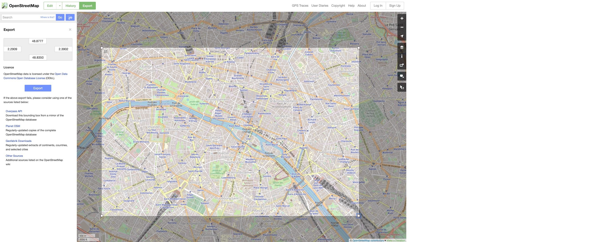
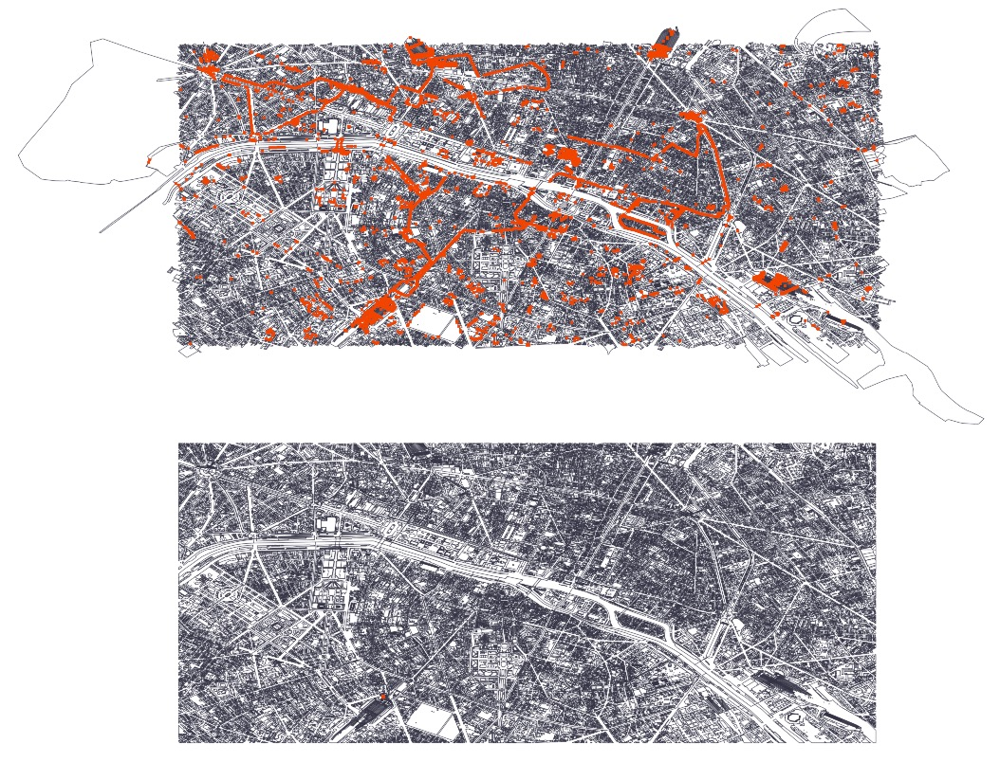
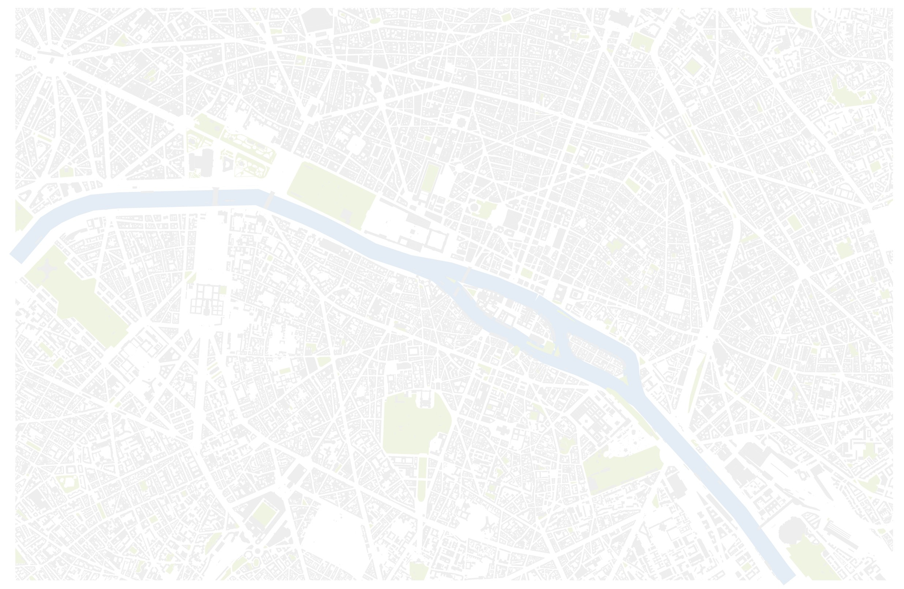
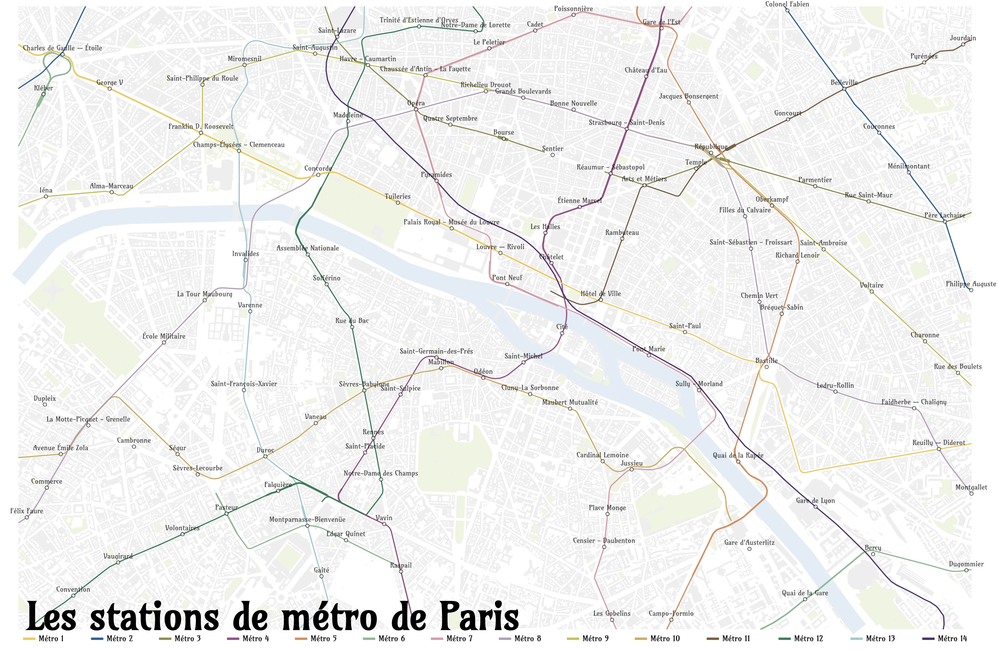

@import "../css/tutorial.less"

```elm {l=hidden}
import VegaLite exposing (..)
```

_This is one of a series of 'geo' tutorials for use with litvis._

1.  [Geospatial File Formats](geoFormats.md)
1.  [Generating Global Map Projection Geo Files](geoGenerating.md)
1.  [Importing geographic datasets into elm-vegalite](geoImporting.md)
1.  **Importing and displaying OpenStreetMap data**

---

# Importing and displaying OpenStreetMap data

This tutorial leads you through a workflow for importing and displaying [OpenStreetMap](https://www.openstreetmap.org) data with litvis. It uses the [Geospatial data abstraction library (GDAL)](https://www.gdal.org) for converting OpenStreetMap data into geoJSON format; [mapshaper](https://mapshaper.org) for filtering data and converting to topoJSON format; and [elm-vegalite](https://package.elm-lang.org/packages/gicentre/elm-vegalite/latest/VegaLite) for composing and displaying map output in litvis.

## 0. Setup

To perform some of the file conversions you will need the [Geospatial Abstraction Data Library (gdal)](http://www.gdal.org), so if you do not have this already, as a one-off setup stage you should install it. Here are some installation instructions for [MacOS](https://medium.com/@vascofernandes_13322/how-to-install-gdal-on-macos-6a76fb5e24a4), for [Windows](https://sandbox.idre.ucla.edu/sandbox/tutorials/installing-gdal-for-windows), and for [Ubuntu](https://mothergeo-py.readthedocs.io/en/latest/development/how-to/gdal-ubuntu-pkg.html)).

After installation, opening a command line window and typing

**`ogr2ogr --version`**

should display a message similar to

```txt
GDAL 2.4.1, released 2019/03/15
```

## 1. Select the OpenStreetMap region

Visit [OpenStreetMap](https://www.openstreetmap.org) and navigate to a region of interest. For the purposes of this tutorial we will select a region of [central Paris](https://www.openstreetmap.org/#map=14/48.8574/2.3439). OSM files can be very large, so try to select a small an area as practical for your purposes, especially when experimenting for the first time.

- Click the _Export_ button (top-left) and if necessary refine your area of interest by clicking _Manually select a different area_ and resizing the bounding box:

  

- Note down the four coordinates defining the bounds of the region you have selected. In this example they are, in _longitudeMin,latitudeMin, longitudeMax, latitudeMax_ order, `2.2909,48.8350,2.3902,48.8777`.

- Click the `Overpass API` link to export the selected region (this will allow you to export a larger region than via the blue `Export` button). It should save a local copy of a file called `map`.

- Rename this downloaded file to `map.osm` (or a more explanatory name with the .osm extension) and if necessary move it to a folder of your choice.

## 2. Converting to GeoJSON format

- Open a command line window and change to the folder containing your .osm file. Then type

  **`ogrinfo map.osm`**

This should display something similar to

```txt
INFO: Open of `map.osm'
  using driver `OSM' successful.
1: points (Point)
2: lines (Line String)
3: multilinestrings (Multi Line String)
4: multipolygons (Multi Polygon)
5: other_relations (Geometry Collection)
```

This indicates that the OSM file contains 5 types of geometry. We will have to extract and convert the types were are interested in. For the purposes of this tutorial we will extract the point, line and polygon features:

- In your command line window, type:

  **`ogr2ogr -f GeoJSON pointMap.geojson map.osm points`**

  **`ogr2ogr -f GeoJSON lineMap.geojson map.osm lines`**

  **`ogr2ogr -f GeoJSON polyMap.geojson map.osm multipolygons`**

This should create three new files representing the point data (e.g. addresses, trees, stations); line data (e.g. cycleways, roads) and polygon data (e.g. buildings and administrative areas).

## 3. Clipping and filtering feature layers with MapShaper

OpenStreepMap files contain many layers of data and many attributes, most of which we will not need for typical visualization applications. We will use the excellent online [mapshaper](https://mapshaper.org) from [Matthew Bloch](https://github.com/mbloch/mapshaper) to perform some spatial and attribute filtering and to convert the selected data into topoJSON format ready for use with Vega-Lite (see also the useful [mapshaper command reference](https://github.com/mbloch/mapshaper/wiki/Command-Reference)).

As a first step, let's extract the building outlines from the OSM `polyMap.geojson` file:

- drag and drop _polyMap.geojson_ into [mapshaper](https://mapshaper.org) and import it with the default options (or simply drag it to the 'quick import' area).

Notice that the bounds of some of the outer polygons extend beyond our defined region of interest. This is because any polygon that even partially overlaps the bounding rectangle we defined previously will be included in the map file.
We can clip all polygons to our region of interest using one of mapshaper's extensive editing commands accessible via the _mapshaper console_:

- In mapshaper, click the **Console** button (top-right) and type:

  **`clip bbox=2.2909,48.8350,2.3902,48.8777`** (the bounding coordinates noted above)


_Polygons displayed in mapshaper before and after clipping._

Next we will select just the features of interest for use with Vega-Lite. In this case we will select just the building and bridge outlines. We can do this with mapshaper's _filter_ command.

- In the mapshaper console, type:

  **`filter 'building != undefined || man_made == "bridge"'`**

  **`o 'buildings.json' format=topojson drop-table`**

The `o` (output) command saves the current file and in this case we add the `drop-table` option to remove all the attributes associated with each geometric feature as we will be simply displaying the building outlines.

We will convert two more layers to display as a map – the parks of Paris and the river Seine. Parks are identified in the _leisure_ label of an OpenStreepMap polygons layer and rivers identified via the _waterway_ label of lines layer, so we perform a similar process as we applied to buildings for each of them:

Parks:

- Refresh the mapshaper page in your browser, drag and drop _polyMap.geojson_ into mapshaper, and open the mapshaper console.
- Clip to the bounding rectangle:

  **`clip bbox=2.2909,48.8350,2.3902,48.8777`** (you can use the up arrow to cycle through previous commands to recall this command)

- extract the parks features:

  **`filter 'leisure == "park"'`**

- Save the filtered features as a topojson file:

  **`o 'parks.json' format=topojson drop-table`**

River Seine:

- Again refresh the mapshaper page, but this time drag _lineMap.geojson_ into mapshaper and open the mapshaper console.
- Clip to the bounding rectangle:

  **`clip bbox=2.2909,48.8350,2.3902,48.8777`**

- extract the river features:

  **`filter 'waterway == "river"'`**

- Save the filtered features as a topojson file:

  **`o 'rivers.json' format=topojson drop-table`**

## 4. Displaying the map layers in Vega-Lite

Now that we have our three topoJSON files (buildings.json, parks.json and rivers.json), we can create a simple Vega-Lite specification to show them, with one set of features per layer. As it is common to use such mapping data as a background over which is displayed other data, we will use a subdued colour scheme to show the three sets of features. Note also that because the rivers are linear not areal features, we use a wide stroke width to show the Seine at approximately its correct scaled width.

Make sure you have the three topoJSON files in a `data` folder located in the same place as your litvis document.

_For this version of the tutorial we define a path to online versions of the data files, but you may wish to edit the path to point to your local files._

```elm {l}
dataPath : String
dataPath =
    -- for local files relative to this document use "./"
    "https://gicentre.github.io/data/geoTutorials/paris/"
```

```elm {l}
parisMap : Spec
parisMap =
    let
        buildingsData =
            dataFromUrl (dataPath ++ "buildings.json") [ topojsonFeature "polyMap" ]

        specBuildings =
            asSpec [ buildingsData, geoshape [ maColor "#eee" ] ]

        parksData =
            dataFromUrl (dataPath ++ "parks.json") [ topojsonFeature "polyMap" ]

        specParks =
            asSpec [ parksData, geoshape [ maColor "rgb(239,244,225)" ] ]

        riversData =
            dataFromUrl (dataPath ++ "rivers.json") [ topojsonFeature "lineMap" ]

        specRivers =
            asSpec
                [ riversData
                , geoshape [ maColor "rgb(226,237,246)", maStrokeWidth 22, maFilled False ]
                ]

        cfg =
            configure
                << configuration (coView [ vicoStroke Nothing ])
    in
    toVegaLite
        [ cfg [], width 1200, height 800, layer [ specRivers, specParks, specBuildings ] ]
```



## 5. A Metro Map of Paris

As an illustration of a more sophisticated extraction of OpenStreetMap data we will create a map of Paris's metro stations and lines to be overlaid on the basemap we produced above.

Some features contained in OpenStreetMap data don't have their own labels like _building_, _waterway_, _leisure_ as we used above. Instead they may be identified via its _name_ or _other_tags_which can contain free text describing the features. This is the case for Paris's Metro stations and lines (as distinct from its mainline and RER stations). To extract these features we can use javascript_regular expressions_ to filter only the metro-relevant features.

To extract the metro lines we filter the lineMap file, but this time we will not drop the attribute table entirely as we need to retain the name of each metro line:

- Refresh the mapshaper page, drag _lineMap.geojson_ into mapshaper and open the mapshaper console.
- Clip to the bounding rectangle:

  **`clip bbox=2.2909,48.8350,2.3902,48.8777`**

- extract the metro line features with a regular expression:

  **`filter 'RegExp(".*Métro.*").test(name)'`**

- Store only the 'name' field associated with each line feature:

  **`filter-fields 'name'`**

- Save the filtered features as a topoJSON file:

  **`o 'metroLines.json' format=topojson`**

For the Metro stations themselves we need to extract them from the _pointMap.geojson_ file and filter them by examining the _other_tags_ content. And because we will by styling these point features in our map we will save the points as a CSV file rather than topoJSON file. Storing as a CSV file can also be useful if you wish to visualize other properties of a point-located dataset.

- Refresh the mapshaper page, drag _pointMap.geojson_ into mapshaper and open the mapshaper console.
- Clip to the bounding rectangle:

  **`clip bbox=2.2909,48.8350,2.3902,48.8777`**

- extract the metro station features with a regular expression:

  **`filter 'RegExp(".*métro.*").test(other_tags)'`**

- Store only the 'name' field associated with each line feature:

  **`filter-fields 'name'`**

- save the longitude,latitude and station name of the points as a CSV file:

  **`each 'longitude=this.x, latitude=this.y' -o 'metroStations.csv'`**

The resulting CSV file representing metro station names and locations includes every point associated with a station which means in some cases we have multiple points for a station with several entrances. For mapping purposes you may decide to manually edit the CSV file removing these duplicate entries along with any others you do not wish to map.

### Cartographic Styling

Now we have all our data (buildings, parks, rivers, metro lines and metro stations) we can create a Vega-Lite specification to show all five layers as we did above for the basemap.

We can improve the styling of the map in a number of ways. Firstly, lets encode the [standard Paris Metro line colours](https://www.ratp.fr/en/plans-lignes/plan-metro):

```elm {l}
metroColours : List ScaleProperty
metroColours =
    categoricalDomainMap
        [ ( "Métro 1", "rgb(242,201,76)" )
        , ( "Métro 2", "rgb(18,97,157)" )
        , ( "Métro 3", "rgb(143,143,72)" )
        , ( "Métro 4", "rgb(159,76,135)" )
        , ( "Métro 5", "rgb(221,140,89)" )
        , ( "Métro 6", "rgb(131,187,144)" )
        , ( "Métro 7", "rgb(223,154,167)" )
        , ( "Métro 8", "rgb(182,157,187)" )
        , ( "Métro 9", "rgb(198,194,79)" )
        , ( "Métro 10", "rgb(207,171,84)" )
        , ( "Métro 11", "rgb(122,94,61)" )
        , ( "Métro 12", "rgb(30,128,90)" )
        , ( "Métro 13", "rgb(151,203,207)" )
        , ( "Métro 14", "rgb(81,46,117)" )
        ]
```

Our map will label each station, so we can use a suitably _art nouveau_ style of lettering in the litvis document by using the [Amarante font](https://fonts.google.com/specimen/Amarante) (linked in the `"../css/tutorial.less` css file).

The specification below simply layers each set of map features as we did previously, but with some additional colour encoding of metro lines and positioning of labels, title and legend:

```elm {l}
metroMap : Spec
metroMap =
    let
        buildingsData =
            dataFromUrl (dataPath ++ "buildings.json") [ topojsonFeature "polyMap" ]

        specBuildings =
            asSpec [ buildingsData, geoshape [ maColor "#eee" ] ]

        parksData =
            dataFromUrl (dataPath ++ "parks.json") [ topojsonFeature "polyMap" ]

        specParks =
            asSpec [ parksData, geoshape [ maColor "rgb(239,244,225)" ] ]

        riversData =
            dataFromUrl (dataPath ++ "rivers.json") [ topojsonFeature "lineMap" ]

        metroLinesData =
            dataFromUrl (dataPath ++ "metroLines.json") [ topojsonFeature "lineMap" ]

        stationsData =
            dataFromUrl (dataPath ++ "metroStations.csv") []

        specRivers =
            asSpec
                [ riversData
                , geoshape [ maColor "rgb(226,237,246)", maStrokeWidth 21, maFilled False ]
                ]

        encMetroLines =
            encoding
                << color
                    [ mName "properties.name"
                    , mNominal
                    , mScale metroColours
                    , mLegend
                        [ leTitle ""
                        , leLabelFont "Amarante"
                        , leSymbolType (symPath "m-2 -0.2h3v0.3h-3")
                        , leOrient loBottom
                        , leDirection moHorizontal
                        , leOffset -5
                        , lePadding 10
                        , leColumnPadding 33
                        ]
                    ]

        specMetroLines =
            asSpec
                [ metroLinesData
                , encMetroLines []
                , geoshape [ maStrokeWidth 1.5, maFilled False ]
                ]

        encStations =
            encoding
                << position Longitude [ pName "longitude", pQuant ]
                << position Latitude [ pName "latitude", pQuant ]

        specStations =
            asSpec
                [ stationsData
                , encStations []
                , point [ maSize 20, maStrokeWidth 0.8, maFill "white", maStroke "black" ]
                ]

        encStationNames =
            encStations
                << text [ tName "name", tNominal ]

        specStationNames =
            asSpec
                [ stationsData
                , encStationNames []
                , textMark [ maDy -8, maFont "Amarante", maFontSize 9, maOpacity 0.7 ]
                ]

        cfg =
            configure
                << configuration (coView [ vicoStroke Nothing ])
                << configuration
                    (coTitle
                        [ ticoOrient siBottom
                        , ticoOffset -65
                        , ticoAnchor anStart
                        , ticoBaseline vaTop
                        , ticoFont "Amarante"
                        , ticoFontSize 48
                        , ticoColor "444"
                        ]
                    )
    in
    toVegaLite
        [ cfg []
        , title "\u{00A0}\u{00A0}Les stations de métro de Paris" []
        , width 1220
        , height 800
        , layer [ specRivers, specParks, specBuildings, specMetroLines, specStations, specStationNames ]
        ]
```


