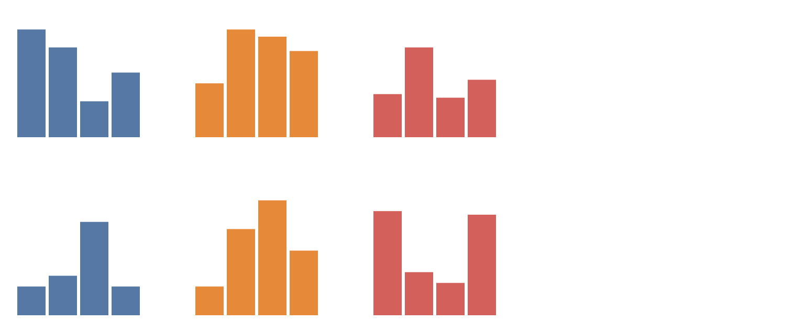

@import "../css/tutorial.less"

_Litvis tutorials: Introducing Elm_

1.  [Introduction](elmIntroduction1.md)
2.  [Functions, functions, functions](elmIntroduction2.md)
3.  [Types and pattern matching](elmIntroduction3.md)
4.  [Lists and list processing](elmIntroduction4.md)
5.  **Elm and elm-vegalite**

---

# Elm and elm-vegalite

The primary goal of litvis is to allow visualizations to be easily integrated into narratives that can describe their design or use.
We can use Elm to help with the visualization side of things by using the [elm-vegalite](https://package.elm-lang.org/packages/gicentre/elm-vegalite/latest/) and, for more flexible but verbose specifications, [elm-vega](https://package.elm-lang.org/packages/gicentre/elm-vega/latest/) packages.

In this tutorial we won't go into too much detail about how to use these packages – for that have a look at the [introduction to elm-vegalite](../introduction/intro1.md) and [elm-vegalite walkthrough](../elmVegaliteWalkthrough/elmVegaliteWalkthrough1.md).
Instead we will consider how to use some of the ideas discussed in this Elm tutorial to help writing functions for visualization.

As you learn to read and write your own code with elm-vegalite you will see and use many new functions as well as the ones we have already covered in this tutorial.
It can be handy to have easy access to the documentation describing both the range of commonly used Elm functions and those specific to elm-vegalite:

- [Elm core API documentation](https://package.elm-lang.org/packages/elm/core/latest/)
- [elm-vegalite API documentation](https://package.elm-lang.org/packages/gicentre/elm-vegalite/latest/VegaLite)

## 1. Anatomy of an elm-vegalite specification

A document that contains any elm-vega code for rendering visualizations needs to import the relevant package functions with the line shown below. The `..` represent a wildcard indicating that we wish all functions in the package to be available to us. The line is only needed once and, more typically, is hidden (with `elm {l=hidden}`) as it adds little to the narrative in the formatted output.

```elm {l}
import VegaLite exposing (..)
```

A typical code block for generating rendered output looks like this:

```elm {l v}
scatterplot : Spec
scatterplot =
    let
        cars =
            dataFromUrl "https://vega.github.io/vega-lite/data/cars.json" []

        enc =
            encoding
                << position X [ pName "Horsepower", pMType Quantitative ]
                << position Y [ pName "Miles_per_Gallon", pMType Quantitative ]
                << color [ mName "Origin", mMType Nominal ]
    in
    toVegaLite [ cars, circle [], enc [] ]
```

Note that the entire specification is declared inside a single function, here called `scatterplot`.
It is necessary to provide a _type signature_ to the function indicating that it will return a `Spec`, which is the _type_ elm-vegalite uses for representing a visualization specification.

The work of creating the JSON that is required by Vega-Lite is done by the [toVegaLite](https://package.elm-lang.org/packages/gicentre/elm-vegalite/latest/VegaLite#toVegaLite) function.
To make the code readable, the elements of the specification are stored as named functions using `let`, typically separating the data (`cars`) from the visual encoding rules (`enc`) from the visual marks (`circle`) used.

Encoding is often where most of the design details are represented.
It represents the specification of which aspects of the data are represented by which visualization channels.
Depending on the complexity of the design, encoding can incorporate many different elements such as size, position, colour and opacity.

Each encoding function, such as [position](https://package.elm-lang.org/packages/gicentre/elm-vegalite/latest/VegaLite#position) or [color](https://package.elm-lang.org/packages/gicentre/elm-vegalite/latest/VegaLite#color) takes a list of [LabelledSpec](https://package.elm-lang.org/packages/gicentre/elm-vegalite/latest/VegaLite#LabelledSpec) types as one of its parameters, to which it adds a new `LabelledSpec` before returning the newly appended list of `LabelledSpec`.

Using the functional composition operator (`<<`) and point-free style keeps the code clean and simple (as above), but it should be noted that the same encoding could be represented by piping an empty list to an encoding channel function before piping that one to the next etc.
So the following is exactly equivalent to the example above, but harder to read:

```elm {xl siding}
scatterplot2 : Spec
scatterplot2 =
    let
        cars =
            dataFromUrl "https://vega.github.io/vega-lite/data/cars.json" []

        enc =
            encoding
                (position X [ pName "Horsepower", pMType Quantitative ] <|
                    position Y [ pName "Miles_per_Gallon", pMType Quantitative ] <|
                        color [ mName "Origin", mMType Nominal ] <|
                            []
                )
    in
    toVegaLite [ cars, circle [], enc ]
```

Or with brackets rather than the `<|` operator (again exactly the equivalent of the previous examples):

```elm {l siding}
scatterplot3 : Spec
scatterplot3 =
    let
        cars =
            dataFromUrl "https://vega.github.io/vega-lite/data/cars.json" []

        enc =
            encoding
                (position X
                    [ pName "Horsepower", pMType Quantitative ]
                    (position Y
                        [ pName "Miles_per_Gallon", pMType Quantitative ]
                        (color [ mName "Origin", mMType Nominal ]
                            []
                        )
                    )
                )
    in
    toVegaLite [ cars, circle [], enc ]
```

It should be clear why functional composition is the preferred style for this kind of chaining of related functions.

## 2. Functions for reuse

One common way in which we can use Elm to ease visualization generation is to abstract repeated or changeable specifications into their own parameterised functions.
For example, we might have several visualizations in a document that each load (a different) dataset from the same source.
If we create a function to store the base location of the data (`dataPath` in the example below), we would only need to change that location once should we wish to use a different data source.

```elm {l}
dataPath : String -> Data
dataPath fileName =
    dataFromUrl ("https://vega.github.io/vega-lite/data/" ++ fileName) []
```

```elm {l v}
myVis1 : Spec
myVis1 =
    let
        enc =
            encoding
                << position X [ pName "Horsepower", pMType Quantitative ]
                << position Y [ pName "Miles_per_Gallon", pMType Quantitative ]
                << color [ mName "Origin", mMType Nominal ]
    in
    toVegaLite [ dataPath "cars.json", circle [], enc [] ]
```

```elm {l v}
myVis2 : Spec
myVis2 =
    let
        enc =
            encoding
                << position X [ pName "date", pMType Temporal ]
                << position Y [ pName "price", pMType Quantitative ]
                << color [ mName "symbol", mMType Nominal ]
    in
    toVegaLite [ dataPath "stocks.csv", line [], enc [] ]
```

## 3. Shaping Data

While Vega-Lite provides a great deal of flexibility in specifying visualization design, it is less able to create or manipulate the data that are to be visualized.
This is where Elm can be helpful in 'shaping' data to be in a format suitable for working with Vega and Vega-Lite.

### Generating Data Inline

Rather than link to externally generated data sources, it is sometimes useful to use Elm to create data programmatically, especially if those data have some predictable structure or generatable content.
[dataFromColumns](https://package.elm-lang.org/packages/gicentre/elm-vegalite/latest/VegaLite#dataFromColumns), [dataFromRows](https://package.elm-lang.org/packages/gicentre/elm-vegalite/latest/VegaLite#dataFromRows), [dataColumn](https://package.elm-lang.org/packages/gicentre/elm-vegalite/latest/VegaLite#dataColumn) and [dataRow](https://package.elm-lang.org/packages/gicentre/elm-vegalite/latest/VegaLite#dataRow) are useful elm-vega functions for doing this (see also the use of [dataFromJson](https://package.elm-lang.org/packages/gicentre/elm-vegalite/latest/VegaLite#dataFromJson) in the [Geospatial file format tutorial](../geoTutorials/geoFormats.md)).

In the example below we use Elm's [List.range](https://package.elm-lang.org/packages/elm/core/latest/List#range) function to generate a list of integers from 1 to 800, the [List.map](https://package.elm-lang.org/packages/elm/core/latest/List#map) function to turn each of those integers into a floating point number and an anonymous function to generate a list of the cosines of each of those values.
We then create two 'columns' of data for use in the visualization specification.
When specifying a data column (with [dataColumn](https://package.elm-lang.org/packages/gicentre/elm-vegalite/latest/VegaLite#dataColumn)) have to state the type of data, which in this case is a list of numbers indicated by [nums](https://package.elm-lang.org/packages/gicentre/elm-vegalite/latest/VegaLite#nums).

```elm {l v siding}
trigCurves : Spec
trigCurves =
    let
        angles =
            List.range 0 800 |> List.map toFloat

        ys =
            List.map (\x -> cos (degrees x)) angles

        data =
            dataFromColumns []
                << dataColumn "angle" (nums angles)
                << dataColumn "y" (nums ys)

        enc =
            encoding
                << position X [ pName "angle", pMType Quantitative, pAxis [ axTickStep 90 ] ]
                << position Y [ pName "y", pMType Quantitative ]
    in
    toVegaLite [ width 400, data [], line [], enc [] ]
```

Elm's `List.range` can only generate a list of integers steps of 1.
We could write our own range-generating function that is more flexible in allowing non-integer values and arbitrary steps between them:

```elm {l}
stepRange : Float -> Float -> Float -> List Float
stepRange start end step =
    let
        numValues =
            floor ((end - start) / step)
    in
    List.range 0 numValues
        |> List.map (\x -> start + toFloat x * step)
```

We could use this, along with a 'point-free' declaration of the cosine calculation function, to provide a more concise specification of the cosine curve that increments in five-degree steps:

```elm {l v siding}
trigCurves : Spec
trigCurves =
    let
        angles =
            stepRange 0 800 5

        data =
            dataFromColumns []
                << dataColumn "angle" (nums angles)
                << dataColumn "y" (nums (List.map (cos << degrees) angles))

        enc =
            encoding
                << position X [ pName "angle", pMType Quantitative, pAxis [ axTickStep 90 ] ]
                << position Y [ pName "y", pMType Quantitative ]
    in
    toVegaLite [ width 400, data [], line [], enc [] ]
```

{(question |}

Can you modify the example above so it shows both the cosine and sine curves for angles between 0 and 800 degrees?

{|question )}

### Tidy Data

Suppose we have some data we wish to visualise that represents values in three categories (e.g. number of bronze, silver and gold medals won by a country). We might represent the data with three numbers, e.g. `30, 15, 12`, indicating the tallies for bronze, silver and gold medals respectively.

If we had data for four countries, we might represent those triples grouped as a table, where each column contains the medal tally for a single country:

| column 1 | column 2 | column 3 | column 4 |
| -------- | -------- | -------- | -------- |
| 30,15,12 | 25,30,25 | 10,28,11 | 18,24,16 |

If we had such data for two years, we might add a further row to the table:

|           | column 1 | column 2 | column 3 | column 4 |
| --------- | -------- | -------- | -------- | -------- |
| **row 1** | 30,15,12 | 25,30,25 | 10,28,11 | 18,24,16 |
| **row 2** | 8,8,29   | 11,24,12 | 26,32,9  | 8,18,28  |

This tabular structure is convenient when working with spreadsheets, or when displaying the data compactly in tabular form.
However, it is not well suited for manipulating programmatically because much of the information is implicitly encoded by the order of numbers (e.g. whether a number represents a silver medal is dependent on its position in a triple of numbers).

Instead it is much more reliable to express the data table in [_tidy_ format](https://vita.had.co.nz/papers/tidy-data.pdf).
That is, in such a way that the order of values in a table is independent of their meaning and that columns of data represent _variables_ and rows of data _observations_.
In our medals example, we could restructure the data as follows:

| row | column | categoy | value |
| --- | ------ | ------- | ----- |
| 1   | 1      | 1       | 30    |
| 1   | 1      | 2       | 15    |
| 1   | 1      | 3       | 12    |
| 1   | 2      | 1       | 25    |
| 1   | 2      | 2       | 30    |
| 1   | 2      | 3       | 25    |
| 1   | 3      | 1       | 10    |
| 1   | 3      | 2       | 28    |
| 1   | 3      | 3       | 11    |
| 1   | 4      | 1       | 18    |
| 1   | 4      | 2       | 24    |
| 1   | 4      | 3       | 16    |
| 2   | 1      | 1       | 8     |
| 2   | 1      | 2       | 8     |
| 2   | 1      | 3       | 29    |
| 2   | 2      | 1       | 11    |
| 2   | 2      | 2       | 24    |
| 2   | 2      | 3       | 12    |
| 2   | 3      | 1       | 26    |
| 2   | 3      | 2       | 32    |
| 2   | 3      | 3       | 9     |
| 2   | 4      | 1       | 8     |
| 2   | 4      | 2       | 18    |
| 2   | 4      | 3       | 28    |

Here, the row and column positions are encoded explicitly so that even if we changed the order of rows or columns, the meaning of the data would not change (if this were a medal table, the values in `column` might be four country names rather than numbers 1 to 4 and the values in `row` might be the years 2012 and 2016 rather than 1 and 2).

The sequencing of numbers in the `row`, `column` and `category` columns show a clear structure that we can generate with Elm.

- `row` contains `1` repeated (_number of columns_ \* _number of categories_) times, followed by `2` repeated the same number of times. We can use Elm's [List.repeat](https://package.elm-lang.org/packages/elm/core/latest/List#repeat) to generate this sequence by repeating values in the list `[1,2]` 12 times each. Because this will generate a list of lists (`[[1,1,1,1,1,1,1,1,1,1,1,1],[2,2,2,2,2,2,2,2,2,2,2,2]]`) we need to 'flatten' it into a single list with Elm's [List.concatMap](https://package.elm-lang.org/packages/elm/core/latest/List#concatMap).

- 'column' contains `[1,2,3,4]` (for the four columns) with each column number repeated _number of categories_ times and then the whole sequence repeated _number of rows_ times. Using `List.repeat` with `List.map` would generate a list of lists of lists, so we need to use both `List.concatMap` and an additional [List.concat](https://package.elm-lang.org/packages/elm/core/latest/List#concat) to flatten into a single list.

- `category` contains `[1,2,3]` (the three categories) repeated (_number of rows \* number of columns_) times, again computable with a combination of `stepRange`, `List.repeat` and `List.concat`.

The example below shows how we might generate the tidy table:

```elm {l}
tidyData : List DataColumn -> Data
tidyData =
    let
        ( numRows, numCols, numCats ) =
            ( 2, 4, 3 )

        rows =
            stepRange 1 numRows 1
                |> List.concatMap (List.repeat (numCats * numCols))
                |> nums

        cols =
            stepRange 1 numCols 1
                |> List.concatMap (List.repeat numCats)
                |> List.repeat numRows
                |> List.concat
                |> nums

        cats =
            stepRange 1 numCats 1
                |> List.repeat (numRows * numCols)
                |> List.concat
                |> nums

        vals =
            [ 30, 15, 12, 25, 30, 25, 10, 28, 11, 18, 24, 16 ]
                ++ [ 8, 8, 29, 11, 24, 12, 26, 32, 9, 8, 18, 28 ]
                |> nums
    in
    dataFromColumns []
        << dataColumn "row" rows
        << dataColumn "col" cols
        << dataColumn "cat" cats
        << dataColumn "val" vals
```

This provides us with a tidy data table that we can use to generate a collection of bar charts faceted by row and column value:

```elm {l v}
barGrid : Spec
barGrid =
    let
        enc =
            encoding
                << position X [ pName "cat", pMType Ordinal, pAxis [] ]
                << position Y [ pName "val", pMType Quantitative, pAxis [] ]
                << color [ mName "cat", mMType Nominal, mLegend [] ]
    in
    toVegaLite
        [ tidyData []
        , spacing 50
        , specification (asSpec [ width 120, height 120, bar [], enc [] ])
        , facet
            [ rowBy [ fName "row", fMType Ordinal, fHeader [ hdTitle "" ] ]
            , columnBy [ fName "col", fMType Ordinal, fHeader [ hdTitle "" ] ]
            ]
        ]
```

{(question |}

Can you modify the example so it facets by category for each row as below?



_Hint: You do not need to make any changes to the tidy data table._

{|question )}
