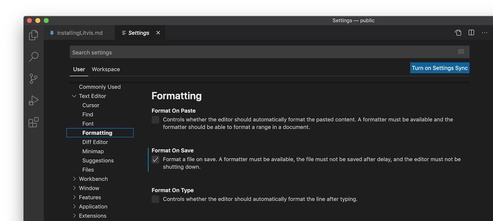
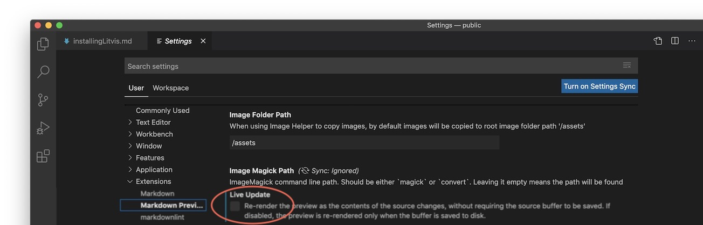
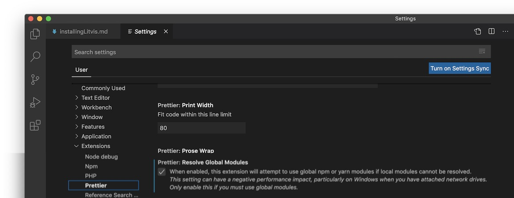

@import "../css/tutorial.less"

1.  **Installing litvis**
1.  [Writing your first litvis documents](intro1.md)
1.  [Branching narratives](intro2.md)
1.  [Narrative schemas](intro3.md)

---

# Installing Litvis with VSCode

## Step 1: Installing Node.js

_You can skip this step if you already have Node.js and npm working on your system._

[Node.js](https://nodejs.org/en/) allows you to run JavaScript programs on your machine without a browser. It includes the package manager _npm_ which litvis uses to install the supplementary packages needed to run litvis.

- **Download and install the 'LTS' (Long Term Support) version of Node from [nodejs.org/en/](https://nodejs.org/en/), accepting the default values during installation.**

On Macs and Linux machines, but not Windows, you need to ensure that when packages are installed with _npm_ (see next step), they are installed in a folder on your machine that has write-access. The following assumes that the shell used in a terminal window is _zsh_ (the default for MacOS Catalina). If your shell is _bash_, simply replace the name `.zshrc` below with `.profile`. If you are not sure what shell your terminal window uses, you can type `echo $SHELL` in the terminal window to find out.

- **_(MacOS / Linux only)_ : Open a terminal window (`applications->utilities->terminal`) and type:**

  - **`mkdir ~/.npm-global`**
  - **`npm config set prefix '~/.npm-global'`**
  - **In your preferred text editor†, open or create the file `~/.zshrc` and add the following line:**
    - **`export PATH=~/.npm-global/bin:$PATH`**
  - **After saving and closing the file, type the following in the terminal window:**
    - **`source ~/.zshrc`**

  _† If you are not sure what text editor to use, try the command-line editor 'nano' from within the terminal window by typing `nano ~/.profile` and when you've added the content, type `ctrl-x` followed by `Y` and then the return key._

## Step 2: Installing Elm and Prettier

Litvis uses the programming language _Elm_ to specify visualizations and process data. It uses _Prettier_ to format code nicely in the editor. Both need to be installed on your system using _npm_:

- **Open a command window (type `cmd` in the search field of the task bar in Windows, or `applications->utilities->terminal` on a Mac)**
- **In the command window / terminal, type:**
  **`npm install --global elm prettier prettier-plugin-elm`**
- **Close the command window / terminal by typing `exit`**

## Step 3: Installing the VSCode Editor

You will be writing your litvis documents in the _VSCode_ text editor.

- **Select the download _Visual Studio Code_ from [visualstudio.com](https://code.visualstudio.com) and install with default settings.**

## Step 4:Installing VSCode Extensions

VSCode is a general, but powerful editor that may be customised with 'extensions'. To use litvis and to make the process of editing and formatting code easier, you need to install some VSCode extensions written for and used by litvis. This is a one-off step to set things up. After configuring you should be able to edit and display litvis documents directly.

- **Start the VSCode editor.**
- **In VSCode, press the _extensions button_ on the left that looks like a stack of four squares.** This should open up a panel allowing you to install various VSCode extensions.
- **Enter 'litvis' in the extensions search field and click the green 'install' button under _Markdown Preview Enhanced with litvis_.** This will allow you to display formatted litvis documents in VSCode.
- **Enter 'prettier' in the search field and click the 'install' button under _Prettier - Code formatter_.** This will help you format litvis documents as you edit them.
- **Enter 'elm tooling' in the search field and click the install button under _Elm tooling_ taking care to select the correct extension that looks like a blue spanner.** This provides supporting functionality when working with the Elm programming language, used extensively with litvis.

- **Close down VSCode.** This will force the three extensions to be initialised the next time you start up VSCode.

## Step 5: Configuring VSCode

- **Restart VSCode. Select the `Preferences->Settings` menu item, which can be found in the `File` menu on Windows or the `Code` menu on MacOS.**

- **Navigate to `Text Editor -> Formatting` section and ensure `Format On Save` is ticked**. This will ensure your code is always correctly formatted, saving much time and debugging effort.
  

- **Navigate to `Extensions -> Markdown Preview Enhanced with litvis` and ensure `Live Update` is _not_ ticked.** This will speed up Litvis so that the preview is only updated when you save modifications to your document.
  

- **Finally navigate to `Extensions -> Prettier` and ensure `Prettier: Resolve Global Modules` is ticked.** This will ensure formatting is applied to your Elm code.
  

- **You can now close the `Settings` tab.**

## Step 6: Check Litvis now works in VSCode

The easiest way to do this is to [write your first litvis document](intro1.md).
