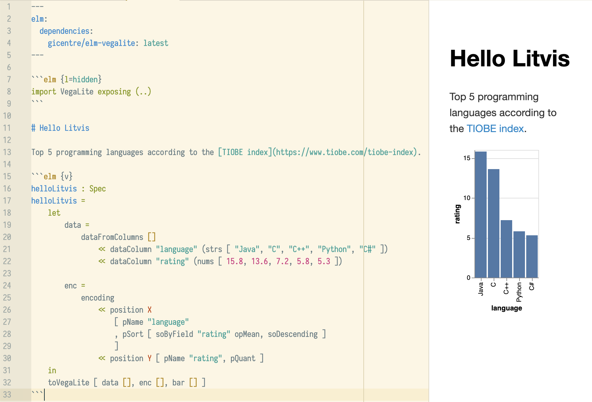

@import "../css/tutorial.less"

```elm {l=hidden}
import VegaLite exposing (..)
```

1.  **Writing your first litvis documents**
2.  [Branching narratives](intro2.md)
3.  [Narrative schemas](intro3.md)

---

# Writing your first litvis documents

At its simplest, a litvis document is just text written using the [markdown](https://github.com/adam-p/markdown-here/wiki/Markdown-Cheatsheet) format.
Markdown has the advantage that it uses easy to remember text formatting instructions that are directly readable even before they are formatted.
For example, have a look at this document in either the [Atom](https://atom.io) or [VS Code](https://code.visualstudio.com) editor making sure to select the preview panel to see the formatted output.

But litvis is more than a markdown editor for text.
You can also write, edit and debug code for creating visualizations; render those visualization directly in your litvis document; arrange alternative visualization designs in _branches_; and validate the text in your litvis documents with _narrtive schemas_.
We will look at each of these in turn.

## Providing a visualization specification

Let's start with a simple litvis document that displays a bar chart.
Create a new document called `helloLitvis.md` and copy the following into it.

````
---
elm:
  dependencies:
    gicentre/elm-vega: latest
---

```elm {l=hidden}
import VegaLite exposing (..)
```

Top 5 programming languages according to the [TIOBE index](https://www.tiobe.com/tiobe-index).

```elm {v}
helloLitvis : Spec
helloLitvis =
    let
        data =
            dataFromColumns []
                << dataColumn "language" (strs [ "Java", "C", "C++", "Python", "C#" ])
                << dataColumn "rating" (nums [ 15.8, 13.6, 7.2, 5.8, 5.3 ])

        enc =
            encoding
                << position X
                    [ pName "language"
                    , pMType Nominal
                    , pSort [ soByField "rating" Mean, Descending ]
                    ]
                << position Y [ pName "rating", pMType Quantitative ]
    in
    toVegaLite [ data [], bar [], enc [] ]
```
````

If you open the preview pane, you should see output similar to the following:



The top of the document is the _header_ fenced with a pair of `---` lines:

```
---
elm:
  dependencies:
    gicentre/elm-vega: latest
---
```

We will be using the [elm-vega](http://package.elm-lang.org/packages/gicentre/elm-vega/latest) package to provide visualization specifications in our litvis documents, so this header just ensures that the relevant module is installed and ready to use.

Litvis documents allow you to write and code directly within them but also to control whether or not the code should be displayed in the formatted output.
The code block

````
```elm {l=hidden}
import VegaLite exposing (..)
```
````

provides a fenced block of code between a pair of ` ``` ` lines where `elm` indicates the code will be written in the [elm language](http://elm-lang.org) and the `{l=hidden}` prevents this particular block of code from being displayed in the formatted output pane.
The code itself just imports the module `VegaLite` from [elm-vega](http://package.elm-lang.org/packages/gicentre/elm-vega/latest) so we can use it later on in the litvis document.

The header and hidden import code block are commonly used at the start of litvis documents to set things up nicely, so can usually just be copied from from one document to the next.

Below the header the remains of the document can mix standard markdown text (e.g. _The top 5 programming languages..._) with fenced code blocks.
In our first example, a function we've called `helloLitvis` creates a visualization specification that defines a simple data table comprising two columns (`language` and `rating`) each of 5 rows, and then encodes the data in the `language` column as horizontal (`X`) position and the `rating` value as vertical (`Y`) position.
Additionally, `language` data are sorted by `rating` from high to low before positioning them (using the [pSort function](http://package.elm-lang.org/packages/gicentre/elm-vega/2.3.0/VegaLite#pSort)) before rendering the data as a collection of `bar` marks to produce a simple bar chart.

You can learn more about the elm language and specifying visualizations in the other [litvis tutorials](../README.md), but here we wil focus on constructing litvis documents.

Notice that `helloLitvis` is defined within a fenced block starting with ` ```elm {v} `.
The `v` indicates we wish to render the result of the specification as a visualization in the formatted output.
Other options could have been to `l` to show a formatted code listing, `j` to show the JSON output produced by the specification, or `r` to show the raw Elm output generated by the function.
These can be included in any combination (e.g. `elm {l v j}`) depending on what you wish to show as output and in what order.

{(question |}

Try changing the values inside the curly braces of `elm {v}` in `helloLitvis.md` to see the effects of `l`, `v`, `j` and `r` on the formatted preview in the editor.

{|question )}

---

_Next >>_ [branching narratives](intro2.md)
