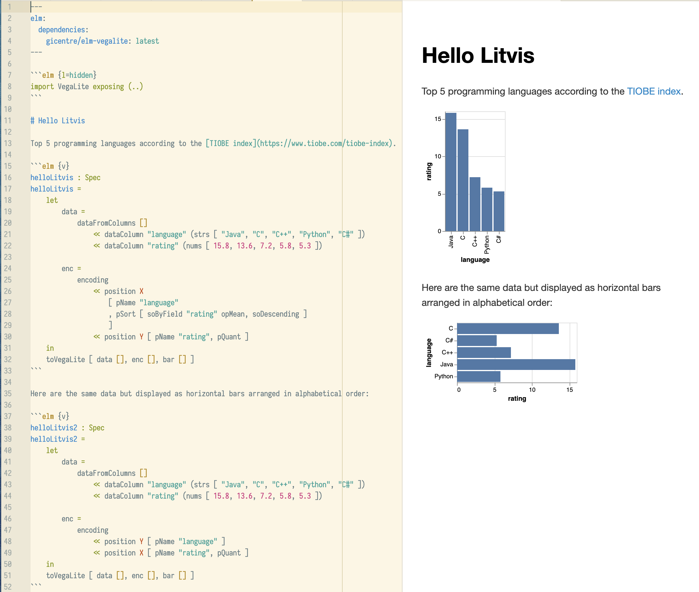

@import "../css/tutorial.less"

1.  **Writing your first litvis documents**
1.  [Branching narratives](intro2.md)
1.  [Narrative schemas](intro3.md)

---

# Writing your first litvis documents

At its simplest, a litvis document is just text written using the [markdown](https://github.com/adam-p/markdown-here/wiki/Markdown-Cheatsheet) format. Markdown has the advantage that it uses easy to remember text formatting instructions that are directly readable even before they are formatted. For example, have a look at this document in either the [Atom](https://atom.io) or [VS Code](https://code.visualstudio.com) editor making sure to select the preview panel to see the formatted output.

But litvis is more than a markdown editor for text. You can also write, edit and debug code for creating visualizations; render those visualization directly in your litvis document; arrange alternative visualization designs in _branches_; and validate the text in your litvis documents with _narrative schemas_. We will look at each of these in turn.

## Providing a visualization specification

Let's start with a simple litvis document that displays a bar chart.
Create a new document called [`helloLitvis.md`](helloLitvisV1.md) and copy the following into it.

````md
---
elm:
  dependencies:
    gicentre/elm-vegalite: latest
---

```elm {l=hidden}
import VegaLite exposing (..)
```

Top 5 programming languages according to the [TIOBE index](https://www.tiobe.com/tiobe-index).

```elm {v}
helloLitvis : Spec
helloLitvis =
    let
        data =
            dataFromColumns []
                << dataColumn "language" (strs [ "Java", "C", "C++", "Python", "C#" ])
                << dataColumn "rating" (nums [ 15.8, 13.6, 7.2, 5.8, 5.3 ])

        enc =
            encoding
                << position X
                    [ pName "language"
                    , pSort [ soByField "rating" opMean, soDescending ]
                    ]
                << position Y [ pName "rating", pQuant ]
    in
    toVegaLite [ data [], enc [], bar [] ]
```
````

If you open the preview pane (in Atom, select `Packages->Markdown Preview Enhanced with litvis->Toggle` or the keyboard shortcut `Shift-Ctrl-M`; or in VS-Code, `Crtl-k` or `Cmd-k` followed by `s`), you should see output similar to the following:


The top of the document is the _header_ fenced with a pair of `---` lines:

```md
---
elm:
  dependencies:
    gicentre/elm-vegalite: latest
---
```

We will be using the [elm-vegalite](https://package.elm-lang.org/packages/gicentre/elm-vegalite/latest) package to provide visualization specifications in our litvis documents, so this header just ensures that the relevant module is installed and ready to use.

Litvis documents allow you to write and code directly within them but also to control whether or not the code should be displayed in the formatted output. The code block

````md
```elm {l=hidden}
import VegaLite exposing (..)
```
````

provides a fenced block of code between a pair of ` ``` ` lines where `elm` indicates the code will be written in the [elm language](http://elm-lang.org) and the `{l=hidden}` prevents this particular block of code from being displayed in the formatted output pane. The code itself just imports the module `VegaLite` from [elm-vegalite](https://package.elm-lang.org/packages/gicentre/elm-vegalite/latest/) so we can use it later on in the litvis document.

The header and hidden import code block are commonly used at the start of litvis documents to set things up nicely, so can usually just be copied from one document to the next.

Below the header the remains of the document can mix standard markdown text (e.g. _The top 5 programming languages..._) with fenced code blocks. In our first example, a function we've called `helloLitvis` creates a visualization specification that defines a simple data table comprising two columns (`language` and `rating`) each of 5 rows, and then encodes the data in the `language` column as horizontal (`X`) position and the `rating` value as vertical (`Y`) position. Additionally, `language` data are sorted by `rating` from high to low before positioning them (using the [pSort function](https://package.elm-lang.org/packages/gicentre/elm-vegalite/latest/VegaLite#pSort)) before rendering the data as a collection of `bar` marks to produce a simple bar chart.

You can learn more about the elm language and specifying visualizations in the other [litvis tutorials](../README.md), but here we will focus on constructing litvis documents.

Notice that `helloLitvis` is defined within a fenced block starting with \`\`\``elm {v}`. The `v` indicates we wish to render the result of the specification as a visualization in the formatted output. Other options could have been to use `l` to show a formatted code listing, `j` to show the JSON output produced by the specification, or `r` to show the raw Elm output generated by the function. These can be included in any combination (e.g. `elm {l v j}`) depending on what you wish to show as output and in what order.

{(question |}

Try changing the values inside the curly braces of `elm {v}` in `helloLitvis.md` to see the effects of `l`, `v`, `j` and `r` on the formatted preview in the editor.

{|question )}

## Working with multiple code blocks

You can mix normal markdown text with fenced code blocks throughout a litvis document. For example, try adding the following text and code to the bottom of [`helloLitvis.md`](helloLitvisV2.md):

````md
Here are the same data but displayed as horizontal bars arranged in alphabetical order:

```elm {v}
helloLitvis2 : Spec
helloLitvis2 =
    let
        data =
            dataFromColumns []
                << dataColumn "language" (strs [ "Java", "C", "C++", "Python", "C#" ])
                << dataColumn "rating" (nums [ 15.8, 13.6, 7.2, 5.8, 5.3 ])

        enc =
            encoding
                << position Y [ pName "language" ]
                << position X [ pName "rating", pQuant ]
    in
    toVegaLite [ data [], enc [], bar [] ]
```
````

which should generate output like this:



By continuing to add text and code samples that render visualizations we can build up literate visualization narratives that lead the reader through the design of a visualization as well as help you as the author of the visualization to organise your thoughts and experiment with design decisions.

But notice that we have some repetition between the two code blocks that share a common data source, and that we have been forced to give the two versions of the function different names (`helloLitvis` and `helloLitvis2`) to avoid name clashes.

By default, functions that are defined in fenced code blocks are visible throughout the entire document (which is why we had to give both rendering functions different names). We can use this to clean things up a little by putting the common code inside its own function to be used by other functions:

````md
```elm {l=hidden}
data =
    dataFromColumns []
        << dataColumn "language" (strs [ "Java", "C", "C++", "Python", "C#" ])
        << dataColumn "rating" (nums [ 15.8, 13.6, 7.2, 5.8, 5.3 ])
```
````

Additionally, we can give our two visualization specification-generating functions the same name by making them _sidings_ – blocks of code that are not accessible to the other parts of the litvis document. This can be useful when you want to create 'one-off' functions that are not referenced elsewhere in your document:

````md
Top 5 programming languages according to the [TIOBE index](https://www.tiobe.com/tiobe-index).

```elm {v siding}
helloLitvis : Spec
helloLitvis =
    let
        enc =
            encoding
                << position X [ pName "language", pSort [ soByField "rating" opMean, soDescending ] ]
                << position Y [ pName "rating", pQuant ]
    in
    toVegaLite [ data [], enc [], bar [] ]
```

Here are the same data but displayed as horizontal bars arranged in alphabetical order:

```elm {v siding}
helloLitvis : Spec
helloLitvis =
    let
        enc =
            encoding
                << position Y [ pName "language" ]
                << position X [ pName "rating", pQuant ]
    in
    toVegaLite [ data [], enc [], bar [] ]
```
````

Not only are these blocks of code now shorter, we only have a single place where our data source is defined, so it becomes easier to change it and see the results cascade through the document.

{(question |}

Try changing the `data` function so that instead of defining the dataset inline, it loads a larger dataset from an external URL:

````md
```elm {l=hidden}
data =
    dataFromUrl "https://gicentre.github.io/data/tiobeIndexMay2018.csv"
```
````

{|question )}

Without changing any other part of the document, the results should be something similar to the [following](helloLitvisV4.md):


---

_Next >>_ [branching narratives](intro2.md)
