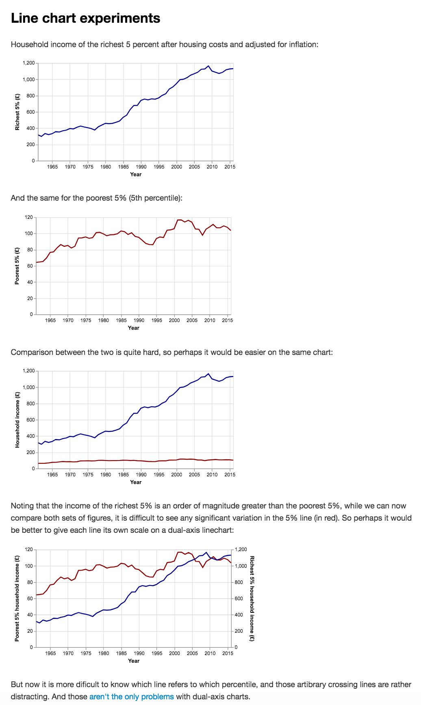
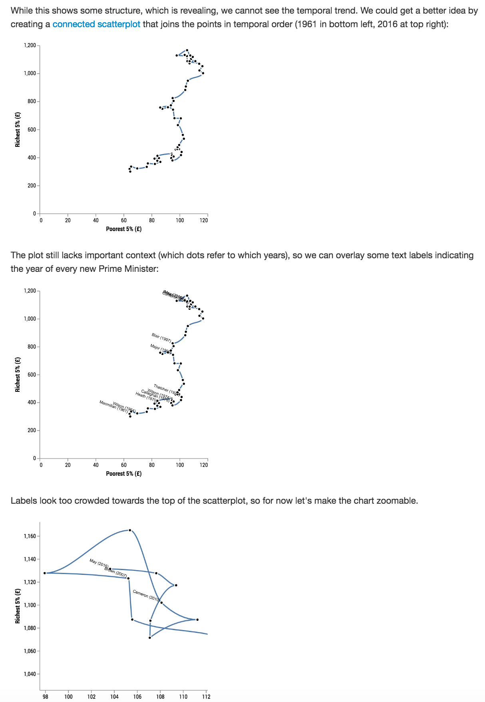
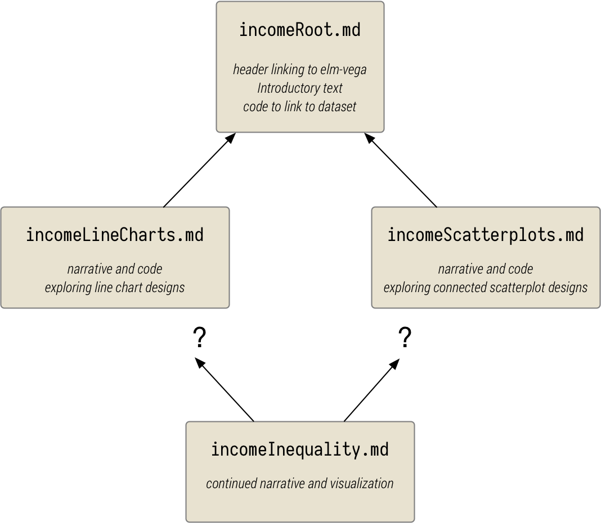

@import "../css/tutorial.less"

1.  [Writing your first litvis documents](intro1.md)
1.  **Branching narratives**
1.  [Narrative schemas](intro3.md)

---

# Branching Narratives

We have already seen in the [previous chapter](intro1.md) that a litvis document can contain many code blocks, each of which can render a different visualization. Sometimes, when we are considering a visualization design we wish to explore different design approaches in order to evaluate their relative strengths and weaknesses. Rather than simply place all of these alternatives in a single document, we can create different 'branches' of a narrative that allows us to explore alternatives in parallel without creating a single, potentially confusing, monolithic narrative.

Let's explore how this might work in practice by considering ways to visualize how household incomes of the richest and poorest 5% have changed over the last 50 years or so.

## 1. The Root

We can start, as we did in the previous chapter, by creating a litvis document with a function to load the data, here provided by the [Institute for Fiscal Studies](http://www.ifs.org.uk/tools_and_resources/incomes_in_uk).

````markdown
---
elm:
  dependencies:
    gicentre/elm-vegalite: latest
---

# Household Income

Household income of the richest 5% (95th percentile) in the UK since 1961.
Data from the [Institute for Fiscal Studies](http://www.ifs.org.uk/tools_and_resources/incomes_in_uk).

```elm {l=hidden}
import VegaLite exposing (..)


data : Data
data =
    dataFromUrl "https://gicentre.github.io/data/incomeInequality2018.csv" []
```
````

{(question |} Create a new file called `incomeRoot.md` and copy the code above into it.
This will act as the 'root' for the branches we will create as it contains the code and text common to all branches. {|question )}

## 2. Line Charts

The data we are initially interested in are in the columns `Year`, `5pcIncome` and `95pcIncome`, so let's explore some line chart designs to show how household income has changed by year. But rather than add code directly to `incomeRoot.md` let's put our line-chart experiments in their own file, which we can call `incomeLineCharts.md`.

{(question |}Copy the file [incomeLineCharts.md](incomeLineCharts.md) into the same folder as `incomeRoot.md`. {|question )}

This should generate formatted output similar to the following where you can experiment with some line chart representations of the data:



{(question |} If you are feeling confident with [elm-vegalite](https://package.elm-lang.org/packages/gicentre/elm-vegalite/latest/) you can try further experiments with line charts by editing `incomeLineCharts.md` {|question )}

Notice that the header of this new file doesn't have the usual `elm dependencies` lines, nor does it import anything or create a `data` function. All of that was defined in `incomeRoot.md`. Instead we link this document to `incomeRoot.md` with the header

```markdown
---
follows: incomeRoot
---
```

This allows us to chain separate files together creating code dependencies as if all linked files were a single document.

Now suppose we've had enough experimentation with line charts and we want to consider a different approach which may or may not be an improvement:

## 3. Connected Scatterplots

To try an alternative set of designs, we can create another document `incomeScatterplot.md` which also follows `incomeRoot`:

{(question |} Copy the file [incomeScatterplots.md](incomeScatterplots.md) into the same folder as `incomeRoot.md` and view the results in the preview pane. {|question )}

This should generate a page where we can explore connected scatterplot designs, a portion of which is shown below:



Note in passing that the final scatterplot allows interactive zooming (try dragging and 'mousewheel zooming' over final scatterplot). To enable interaction with a visualization that specifies it (here with the line `selection << select "view" Interval [ BindScales ]`), simply add an `interaction` keyword at the start of the code block:

````markdown
```elm {v interactive}
scatter : Spec
scatter = ...
```
````

## 4. Continuing the narrative

We can summarise the two parallel branches as a tree structure.
Depending on which approach we think the better one we can continue exploring income inequality by adopting one or other of the designs and linking a new file with either `follows:incomeLineCharts` or `follows:incomeScatterplots` in the header.



Alternatively we could continue to develop both branches to see if we can improve them further. Or perhaps a completely different approach might occur to us, in which case we simply add a new parallel branch.

{(question |} Try creating `incomeInequality.md` and link to your preferred design and see if you can improve upon it as you explore patterns of income inequality. The [original data file](https://gicentre.github.io/data/incomeInequality2018.csv) also contains data on the governing political party which you may want to incorporate into your visualization and analysis. {|question )}

---

_Next >>_ [narrative schemas](intro3.md)
