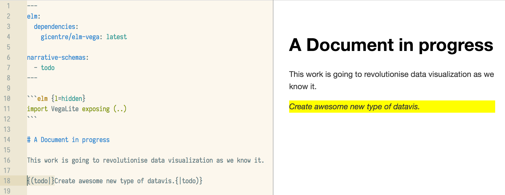
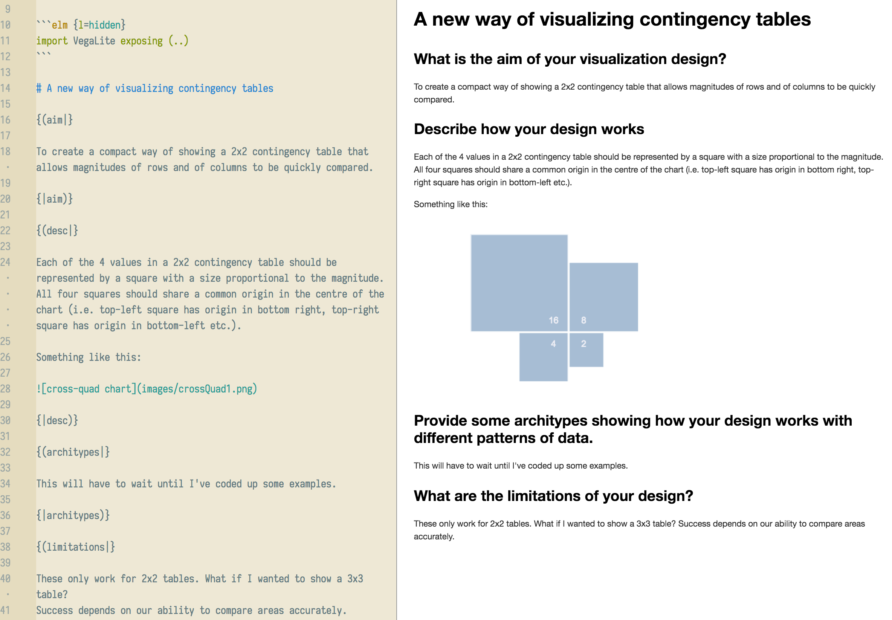

@import "../css/tutorial.less"

```elm {l=hidden}
import VegaLite exposing (..)
```

1.  [Writing your first litvis documents](intro1.md)
2.  [Branching narratives](intro2.md)
3.  **Narrative schemas**

---

# Narrative Schemas

The elm compiler used by litvis should do a good job at highlighting errors your code for generating visualizations.
But what about the textual narratives you write along with the code?

This is where you can use _narrative schemas_ to guide you in writing text.
A narrative schema is simply a set of rules you define (either yourself or by using an existing schema) that specifies the structure or content of your litvis document.
These rules might be as simple as 'if you define a section of text with this heading, it must contain some content', or more complex such as 'this document must contain these 6 sections in this order, each with at least 300 characters of text'.

Their value comes in providing you with _scaffold_ to guide the writing of litvis documents so they have some desired structure.
Documents that are validated against a narrative schema will be flagged in litivis with a warning message if they don't follow the rules defined in the schema.

## A simple example

Narrative schemas are written as [yaml](http://yaml.org) documents, which provide a concise syntax for rule specification.
Here is one for declaring a simple 'todo' label to highlight unfinished parts of a document:

```yaml
labels:
  - name: todo
    paired:
      htmlTemplate: <div class="todo">{{children}}</div>

rules:
  - description: There should always be some content between 'todo' labels.
    selector:
      label: todo
    children:
      minimumTrimmedTextLength: 1

styling:
  css: |
    .todo {
      font-style: italic;
      background: yellow;
    }
```

The schema definition comprises three parts: a set of named _labels_ which you are able to insert into your litvis document (here we have just one we've called `todo`); a set of _rules_ that determine how those labels should be used; and a set of _stylings_ (using normal CSS syntax) that determine how any labels or content within them should appear when formatted.

In this example, `todo` is a _paired label_ meaning that when used it has an opening label and a corresponding closing label, between which can be some content.
In the schema this content is always referenced with the name `children` and in this case we insert some html (a `div`) to allow the content to be styled.

Each rule should contain a `description` to be reported if the rule is broken, the label the rule applies to and then the rule itself.
In this example we specify that the content between the paired labels must be at least 1 character long.

Finally we can apply standard css styling to the html described in the `htmlTemplate`.
Here we create a yellow background and italic text for any such content.

To see the schema in action, copy the schema above into a file `todo.yaml` then create a new litvis document into which you copy the following code:

````
---
elm:
  dependencies:
    gicentre/elm-vega: "3.0"

narrative-schemas:
  - todo
---

```elm {l=hidden}
import VegaLite exposing (..)
```

# A Document in progress

This work is going to revolutionise data visualization as we know it.

{(todo|}Create awesome new type of datavis.{|todo)}
````

Notice that the header now contains the line `narrative-schemas:` followed by the name, without extension, of the schema file `todo.yaml`.
This will ensure that the document is always validated against the referenced schema.

Within the main body of the litvis document the labels are inserted by enclosing the opening label in `{( |}` and the closing label in `{| )}`.
Between the two we can write the content that will be processed when referenced by `children` in the schema rules.

{(question|} Check to see that the text that begins `This work is going to...` is highlighted in yellow in the preview pane (as below).
Try deleting the content between the `todo` labels to check that the editor flags the warning: `There should always be some content between 'todo' labels. (narrative-schema:rule-validation)`. {|question)}



## Controlling Narrative Sequencing

A common form of schema is to require a litvis document to include a number of specific headings that are to be presented in a fixed order.
For example, when exploring a new form of data visualization we might force ourselves to ask and answer the following questions and prompts:

1.  What is the aim of your visualization design?
2.  Describe how your design works.
3.  Provide some architypes showing how your design works with different patterns of data.
4.  What are the limitations of your design?

We can turn these into a schema, which we'll call `newIdiom`, as follows:

```yaml
labels:
  - name: aim
    paired:
      htmlTemplate: <div><h2>What is the aim of your visualization design?</h2><div>{{children}}</div></div>
  - name: desc
    paired:
      htmlTemplate: <div><h2>Describe how your design works</h2><div>{{children}}</div></div>
  - name: architypes
    paired:
      htmlTemplate: <div><h2>Provide some architypes showing how your design works with different patterns of data.</h2><div>{{children}}</div></div>
  - name: limitations
    paired:
      htmlTemplate: <div><h2>What are the limitations of your design?</h2><div>{{children}}</div></div>

rules:
  - description: Narrative must contain one set of aims.
    selector:
      label: aim
    minimumOccurrences: 1
    maximumOccurrences: 1

  - description: Aims should be provided before the design is described.
    selector:
      label: aim
    before:
      selector:
        label: desc

  - description: Narrative must contain one description of the idiom.
    selector:
      label: desc
    minimumOccurrences: 1
    maximumOccurrences: 1

  - description: Narrative must always contain at least one set of limitations.
    selector:
      label: limitations
    minimumOccurrences: 1

  - description: An idiom's description should be provided before listing its limtitations.
    selector:
      label: desc
    before:
      selector:
        label: limitations
```

Here we add a few more rules that specify that there must be one `aim` label in the document, one `desc` label and at least one `limitations`.
Additionally we specify the order of labels by requiring `aim` must occur before `dec` which itself must occur before `limitations`.

Below is an example litvis document that conforms to this narrative schema:

````
---
elm:
  dependencies:
    gicentre/elm-vega: "3.0"

narrative-schemas:
  - newIdiom
---

```elm {l=hidden}
import VegaLite exposing (..)
```

# A new way of visualizing contingency tables

{(aim|}

To create a compact way of showing a 2x2 contingency table that allows magnitudes of rows and of columns to be quickly compared.

{|aim)}

{(desc|}

Each of the 4 values in a 2x2 contingency table should be represented by a square with a size proportional to the magnitude. All four squares should share a common origin in the centre of the chart (i.e. top-left square has origin in bottom right, top-right square has origin in bottom-left etc.).

Something like this:


{|desc)}

{(architypes|}

This will have to wait until I've coded up some examples.

{|architypes)}

{(limitations|}

These only work for 2x2 tables. What if I wanted to show a 3x3 table?
Success depends on our ability to compare areas accurately.

{|limitations)}
````

This generates output as follows:



{(question|}Try creating your own simple narrative-schema that encourages a _Socratic dialogue_.
That is, a 'conversation' between two voices, one asking naive questions about a design, the other answering those questions (e.g. "Why are you using a bar chart to show these data?" / "It makes it easy to compare magnitudes and is a compact representation"). {|question)}

---
