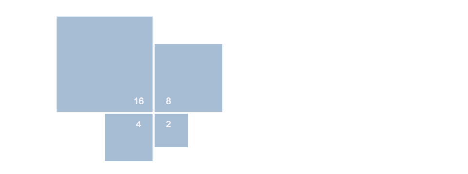

---
elm:
  dependencies:
    gicentre/elm-vegalite: latest

narrative-schemas:
  - newIdiom
---

```elm {l=hidden}
import VegaLite exposing (..)
```

# A new way of visualizing contingency tables

{(aim|}

To create a compact way of showing a 2x2 contingency table that allows magnitudes of rows and of columns to be quickly compared.

{|aim)}

{(desc|}

Each of the 4 values in a 2x2 contingency table should be represented by a square with a size proportional to the magnitude. All four squares should share a common origin in the centre of the chart (i.e. top-left square has origin in bottom right, top-right square has origin in bottom-left etc.).

Something like this:



{|desc)}

{(architypes|}

This will have to wait until I've coded up some examples.

{|architypes)}

{(limitations|}

These only work for 2x2 tables. What if I wanted to show a 3x3 table?
Success depends on our ability to compare areas accurately.

{|limitations)}
