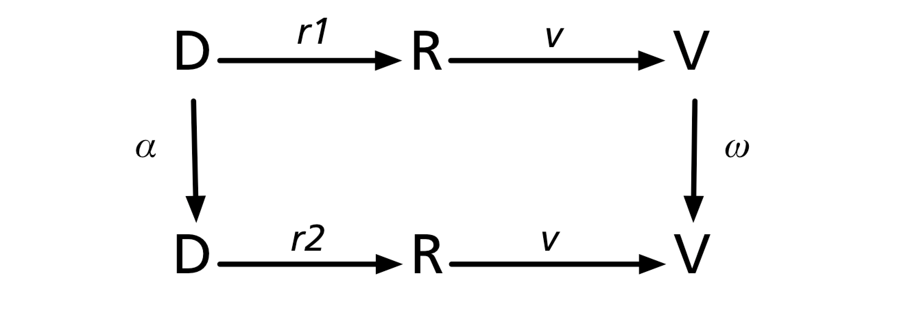

@import "assets/litvis.less"

```elm {l=hidden}
import VegaLite exposing (..)
```

# Kindlmann and Scheidegger Visualization Algebra Schema Example

Uses a schema for considering the Kindlmann and Scheidegger (2014) algebra in visualization design.
As a reminder, we consider the transformations between data (D) and visualization (V) through an intermediate stage of data representation on computer (R).
_α_ represents some transform in data and _ω_ some transform in visualization.

In a good visualization design we would expect:

- a _correspondence_ between α and ω: as data varies in some way we would expect to see a corresponding variation in the visualization sufficient to infer how the data varies.
- that if α is the identity transform (i.e. no change in data), two different data representations should yield identical visualizations (therefore ω is also an identity transform).
- that if ω is the identity transform (i.e. two similar looking visualizations), this should only arise when α is also an identity transform (i.e. two similar data sources).

This can be summarised by saying that the paths from the D in the top left corner to the V in the bottom right should be equivalent either by traversing right then down _(r1 >> v >> ω)_ or down then right _(α >> r2 >> v )_.
That is, the diagram is _commutative_.



Failures in the invariance principle result in _hallicinators_ (unimportant change in R results in salient changes in V).
Failures in the unambiguity principle result in _confusers_ (meaninful changes in D cannot be seen in V).
Failures in the correspondence princple result in _jumblers_ (change in D does not result in an equivalent change in V) or _misleaders_ (change in V don't reflect equivalent change in D).

## Brexit Voting Map

We wish to construct a map of regional preferences in the 2016 UK referendum on leaving the EU ('brexit').
Here is a candidate design:

^^^elm {v=(brexitMap Large NoChange BySize Desc)}^^^

Does it satisfy the princples of _invariance_, _unambiguity_ and _correspondence_?

## Principle of Representation Invariance

{( invariance |}

^^^elm {v=[(brexitMap Small NoChange ByLongitude Asc),(brexitMap Small NoChange ByLatitude Asc),(brexitMap Small NoChange BySize Asc),(brexitMap Small NoChange BySize Desc)]}^^^

{| invariance)}

{( invarianceAssessment |}

Varying the order in which data rows are plotted shows noticable differences, especially in the London region.
Therefore failing this principle introduces _hallucinators_.
This is due to considerable overlap of the proportional circles.

- [ ] passed?

{| invarianceAssessment)}

## Principle of Unambiguous Data Depiction

{( unambiguity |}

^^^elm {v=[,(brexitMap Medium (LeaveBy 5) BySize Desc),(brexitMap Medium (LeaveBy 0) BySize Desc),(brexitMap Medium (LeaveBy -5) BySize Desc)]}^^^

{| unambiguity )}

{( unambiguityAssessment |}

Systematic shifts by 5% of votes cast towards leave or remain are easily detectable where they affect the majorty (shift between red and blue).
Systematic shifts that don't cross the 50% boundary are also detectable, although less obvious.
See for example size of blue circles in Scotland or red circles in Midlands/Northern England.
Therefore, no evidence for _confusers_ in design.

- [x] passed?

{| unambiguityAssessment )}

## Principle of Visual-Data Correspondence

{( correspondence |}

^^^elm {v=[(brexitMap Medium (LeaveBy 0) BySize Desc),(brexitMap Medium Rand5pc BySize Desc)]}^^^

^^^elm {v=[(brexitMap Medium (LeaveBy -5) BySize Desc),(brexitMap Medium (LeaveBy 0) BySize Desc),(brexitMap Medium (LeaveBy 5) BySize Desc)]}^^^

^^^elm {v=[(brexitMap Medium (LeaveBy 10) BySize Desc),(brexitMap Medium (LeaveBy 15) BySize Desc),(brexitMap Medium (LeaveBy 20) BySize Desc)]}^^^

{| correspondence )}

{( correspondenceAssessment |}

Adding a random 5% uniform random perturbation to the results (which is not a meaningful change in data) gives rise to a largely similar visualization.
Small changes are most easily detected where the shift crosses the 50% boundary, but this is not generally a problem as these are the smallest circles, having the smallest majorities.

As noted under _unambiguous data depiction_, systematic increases in either the remain or leave directions result in expected and detectable changes in size and colour.
Because of the problems with _hallucinators_ combined with ordering from largest to smallest majority, there are occasionally red/blue reordering such as the Brighton region between the 15% and 20% increase in leave examples.

Overall there is no evidence of any _jumblers_.
While not tested directly, there is no evidence to point towards _misleaders_ other than the re-ordering of two overlapping discs with similar majorities (size) but on opposite sides of leave-remain.

- [x] passed?

{| correspondenceAssessment )}

---

```elm {l=hidden}
type OrderType
    = ByLongitude
    | ByLatitude
    | BySize


type SortOrder
    = Asc
    | Desc


type DataChange
    = NoChange
    | Rand5pc
    | LeaveBy Float


type MapSize
    = Small
    | Medium
    | Large


brexitMap : MapSize -> DataChange -> OrderType -> SortOrder -> Spec
brexitMap mapSize dChange orderType oDirection =
    let
        orderParams =
            let
                sortOrder =
                    case oDirection of
                        Asc ->
                            oSort [ soAscending ]

                        Desc ->
                            oSort [ soDescending ]
            in
            case orderType of
                ByLongitude ->
                    [ oName "Longitude", oMType Quantitative, sortOrder ]

                ByLatitude ->
                    [ oName "Latitude", oMType Quantitative, sortOrder ]

                BySize ->
                    [ oName "majority %", oMType Quantitative, sortOrder ]

        titleText =
            let
                oText =
                    case oDirection of
                        Asc ->
                            "increasing"

                        Desc ->
                            "decreasing"

                cText : Float -> String
                cText pc =
                    if pc < 0 then
                        "Swing by " ++ String.fromFloat (abs pc) ++ "% away from leave"

                    else if pc == 0 then
                        "Original vote"

                    else
                        "Swing by " ++ String.fromFloat pc ++ "% to leave vote"
            in
            case ( mapSize, dChange, orderType ) of
                ( Large, _, _ ) ->
                    ""

                ( _, NoChange, ByLongitude ) ->
                    oText ++ " longitude"

                ( _, NoChange, ByLatitude ) ->
                    oText ++ " latitude"

                ( _, NoChange, BySize ) ->
                    oText ++ " size"

                ( _, LeaveBy pc, _ ) ->
                    cText pc

                ( _, Rand5pc, _ ) ->
                    "Random 5% change"

        dataFilter =
            case dChange of
                Rand5pc ->
                    filter (fiEqual "DataSource" (str "rand5pc"))

                _ ->
                    filter (fiEqual "DataSource" (str "Original"))

        multiplier =
            case dChange of
                LeaveBy pc ->
                    String.fromFloat (pc / 100)

                _ ->
                    "0"

        ( w, h, legend ) =
            case mapSize of
                Small ->
                    ( 130, 280, [ mLegend [] ] )

                Medium ->
                    ( 180, 400, [ mLegend [] ] )

                Large ->
                    ( 300, 600, [] )

        gbSpec =
            asSpec
                [ dataFromUrl "https://gicentre.github.io/data/gbRegions.json" [ topojsonFeature "regions_id_geo" ]
                , geoshape [ maStroke "#fff", maStrokeWidth 0.1, maFill "#ddd" ]
                ]

        trans =
            transform
                << dataFilter
                << calculateAs ("datum.RemainVotes*1 - " ++ multiplier ++ "*datum.LeaveVotes") "remain"
                << calculateAs ("datum.LeaveVotes*1 + " ++ multiplier ++ "*datum.LeaveVotes") "leave"
                << calculateAs "100 * datum.leave / (datum.remain + datum.leave)" "percLeave"
                << calculateAs "abs(datum.percLeave-50)" "majority %"
                << calculateAs "datum.remain > datum.leave ? 'remain' : 'leave'" "majority decision"

        votingSpec =
            asSpec
                [ dataFromUrl "https://gicentre.github.io/data/brexit.tsv" []
                , trans []
                , circle [ maStroke "white", maStrokeWidth 0.5 ]
                , votingEnc []
                ]

        votingEnc =
            encoding
                << position Longitude [ pName "Longitude", pMType Quantitative ]
                << position Latitude [ pName "Latitude", pMType Quantitative ]
                << size ([ mName "majority %", mMType Quantitative ] ++ legend)
                << order orderParams
                << color
                    ([ mName "majority decision"
                     , mMType Nominal
                     , mScale (categoricalDomainMap [ ( "remain", "rgb(50,50,200)" ), ( "leave", "rgb(200,50,50)" ) ])
                     ]
                        ++ legend
                    )

        config =
            configure
                << configuration (coView [ vicoStroke Nothing ])
                << configuration (coScale [ sacoMaxSize w ])
                << configuration (coTitle [ ticoFontSize 10, ticoBaseline vaBottom ])
    in
    toVegaLite
        [ width w
        , height h
        , title titleText
        , layer [ gbSpec, votingSpec ]
        , config []
        ]
```
